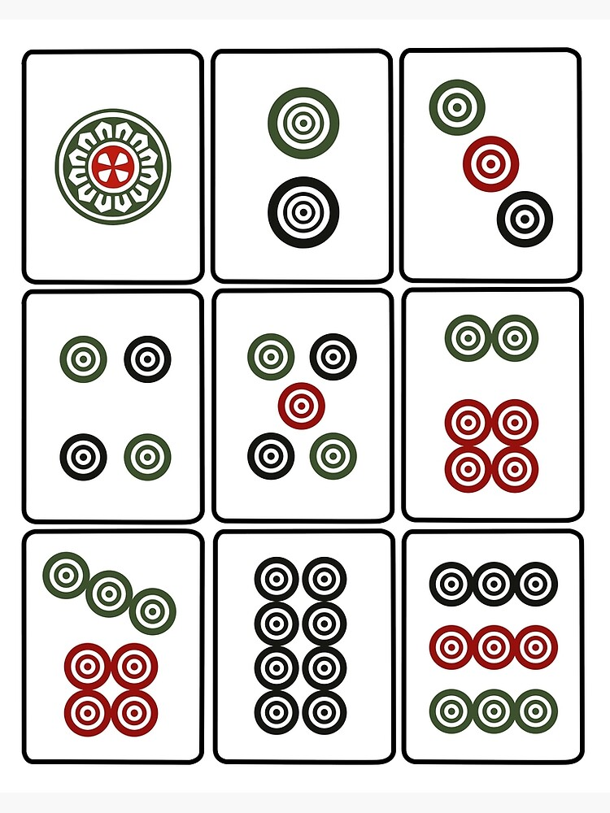

# Mahjong Basics 🀄

This document introduces the **core mechanics of Mahjong**.
It focuses on universal concepts that apply to most Mahjong variants.

---

## 🎯 Objective

The goal of Mahjong is to build a **winning hand** consisting of:

* **4 melds (sets)** + **1 pair**

A player wins by completing this structure and declaring **“Hu” (胡)**.

---

## 🧩 Tiles

A standard Mahjong set includes several types of tiles.

---

### 🟡 Dots (Circles)

   ```
   
   ```

---

### 🟢 Bamboo

| 1  | 2  | 3  | 4  | 5  | 6  | 7  | 8  | 9  |
| -- | -- | -- | -- | -- | -- | -- | -- | -- |
| 🀐 | 🀑 | 🀒 | 🀓 | 🀔 | 🀕 | 🀖 | 🀗 | 🀘 |

---

### 🔴 Characters (万)

| 1  | 2  | 3  | 4  | 5  | 6  | 7  | 8  | 9  |
| -- | -- | -- | -- | -- | -- | -- | -- | -- |
| 🀇 | 🀈 | 🀉 | 🀊 | 🀋 | 🀌 | 🀍 | 🀎 | 🀏 |

---

### 🌬️ Winds

| East | South | West | North |
| ---- | ----- | ---- | ----- |
| 🀀   | 🀁    | 🀂   | 🀃    |

---

### 🐉 Dragons

| Red | Green | White |
| --- | ----- | ----- |
| 🀄  | 🀅    | 🀆    |

---

💡 Each tile typically appears **4 times** in the set.

⚠️ Some variants (like Sichuan Mahjong) may remove honor tiles.

---

## 🪑 Players & Setup

* Mahjong is typically played with **4 players**
* Each player starts with:

  * **13 tiles**
* The dealer may start with **14 tiles**

---

## 🔄 Gameplay Flow

Mahjong is played in turns.

### On Your Turn:

1. **Draw a tile** from the wall
2. Decide your move:

   * Form sets
   * Adjust your hand
3. **Discard one tile**

👉 The turn then passes to the next player.

---

## 🧱 Basic Hand Structure

A standard winning hand consists of:

* **4 melds (sets)**:

  * Sequence or triplet
* **1 pair**:

  * Two identical tiles

---

## 🔗 Meld Types

### Chow (吃)

* A **sequence of 3 consecutive numbers**
* Same suit only
* Example: 🀛 🀜 🀝 (3-4-5 Dots)

---

### Pong (碰)

* **3 identical tiles**
* Example: 🀇 🀇 🀇 (1 Character)

---

### Kong (杠)

* **4 identical tiles**
* A special type of set
* Often gives bonus or extra draw (depends on rules)

---

## 🧠 Key Concepts

### Hidden vs Exposed Sets

* **Hidden (Concealed)**: Formed using your own tiles
* **Exposed**: Claimed from another player’s discard

---

### Calling Tiles

You may take another player’s discarded tile to form:

* Chow (usually only from the previous player)
* Pong
* Kong

---

## 🏁 Winning (Hu / 胡)

You win when:

* Your hand forms **4 melds + 1 pair**
* You complete your hand by:

  * Drawing a tile, or
  * Claiming another player’s discard

---

## ⚠️ Important Notes

* Exact rules vary by region and style
* Some variants:

  * Remove certain tiles
  * Add special winning patterns
  * Change scoring systems

---

## ➡️ Next Step

After understanding these basics, continue with:

* 📄 `docs/classic-mahjong-rules.md`
* 📄 `docs/sichuan-mahjong-rules.md`

to learn how different Mahjong styles modify these core rules.

---

## 🖼️ (Optional) Replace with Images Later

If you want real tile images:

1. Create:

   ```
   docs/assets/tiles/
   ```

2. Replace symbols like:

   ```
   🀙
   ```

   with:

   ```
   
   ```

This will turn your guide into a **fully visual Mahjong manual**.
